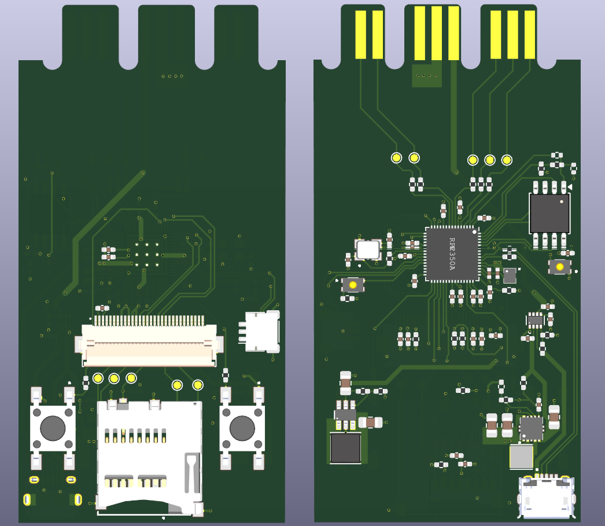
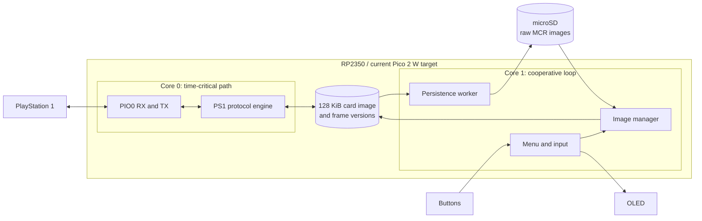

[](https://github.com/Blachovsky/PS-microCard/actions/workflows/build.yml)<br>
[](https://github.com/Blachovsky/PS-microCard/actions/workflows/tests.yml)<br>
[](https://github.com/Blachovsky/PS-microCard/actions/workflows/markdown.yml)

# PS-microCard

**An RP2350-based PlayStation 1 memory card emulator with microSD-backed virtual cards, an OLED user interface and a custom PCB designed in KiCad.**

PS-microCard is an embedded hardware and firmware project that replaces a standard PlayStation 1 memory card with a programmable device capable of storing and switching multiple card images on a microSD card.

The project combines real-time console communication, RP2350 PIO, dual-core firmware, persistent storage, a small on-device UI, automated host-side testing, and custom electronics design.

> **Project status:** the current firmware builds for and is configured for a Raspberry Pi Pico 2 W development setup. The custom RP2350 PCB has been designed but not assembled or electrically validated, and its GPIO map, card-detect polarity, and OLED controller are not compatible with the current binary.

<p align="center"> 
 
</p> 
<p align="center"> 
<i> Custom PCB designed in KiCad. Hardware prototype not yet assembled.</i> 
</p>
[Watch the breadboard prototype demo](https://github.com/user-attachments/assets/f54d0bfc-f955-47ab-805d-b30cb20fdbb1)

## What it does

- Emulates a PlayStation 1 memory card at the console interface.
- Stores raw 131072-byte (`128 KiB`) `.MCR` memory-card images on a microSD card.
- Allows multiple virtual card images to be created, selected, and deleted.
- Provides an OLED menu controlled with two physical buttons.
- Displays directory-slot metadata from the selected image: filename, slot number, and derived block count.
- Keeps time-critical PlayStation communication separate from slower storage and UI work.
- Handles storage failures and SD-card removal without treating unconfirmed writes as safely persisted.

## Project highlights

### Real-time embedded firmware

The PlayStation memory-card interface is serviced on one RP2350 core, with PIO used for the low-level serial transport. Time-sensitive code is separated from filesystem and UI operations to reduce their interference with console communication; worst-case behavior still requires measurement on hardware.

### Dual-core architecture

The firmware splits responsibilities between the two RP2350 cores:

- **Core 0** — PlayStation bus handling and memory-card emulation.
- **Core 1** — microSD persistence, image management, OLED UI, and button input.

This separation keeps latency-sensitive work predictable while allowing the device to perform filesystem operations in parallel.

### Failure-aware persistence

Game saves are first reflected in the in-memory card image and are then persisted to microSD by a background worker. The worker confirms modified frames only after write, sync, and close succeed. Its retry bookkeeping works while RAM is preserved, but the current top-level SD recovery path reloads `CARD000.MCR`; RAM-only writes are therefore not guaranteed to survive a detected storage failure or removal.

### Custom hardware

The repository includes a custom RP2350-based PCB designed in **KiCad**, together with the schematic, PCB layout, component footprints, symbols, and 3D models used by the design. It is currently a design artifact, not a supported firmware target.

### Automated testing and CI

The firmware currently includes **75 host-side tests**:

- **61 unit tests**
- **14 integration tests**

The integration suite exercises host-simulated flows across the PS1 protocol layer, in-memory card state, and persistence worker. It does not execute the production PIO programs, menu loop, real FatFs/SD stack, or physical dual-core hardware.

GitHub Actions automatically builds the RP2350 firmware and runs the complete host-side test suite on pushes and pull requests.

## Architecture at a glance



Detailed protocol behavior, timing considerations, concurrency design, persistence limits, and hardware status are documented in [`docs/`](docs/README.md).

## Repository structure

```text
PS-microCard/
├── firmware/              Embedded C firmware for the RP2350
│   ├── board/             Board and peripheral configuration
│   ├── drivers/           OLED and low-level device drivers
│   ├── menu/              OLED UI and menu controller
│   ├── micro_sd/          Image management and persistence worker
│   ├── ps1/               PS1 memory-card protocol and PIO transport
│   └── tests/             Host-side unit and integration tests
├── hardware/              KiCad schematic, PCB and project libraries
├── docs/                  Technical project documentation
└── .github/workflows/     Firmware build and test automation
```

## Technology stack

| Area | Technologies |
| --- | --- |
| MCU | RP2350 / Raspberry Pi Pico 2 W development target |
| Firmware | C11, Raspberry Pi Pico SDK |
| Real-time I/O | RP2350 PIO, GPIO |
| Concurrency | RP2350 multicore |
| Storage | microSD, FatFs |
| User interface | Current setup: DFRobot DFR0650 / SSD1306 128×64 OLED and two buttons; custom PCB: DEP128064C2-W / SH1106G, not yet ported |
| Hardware design | KiCad |
| Testing | Ceedling, Unity, CMock |
| CI | GitHub Actions |
| Build system | CMake, Ninja |

## Testing

Host-side tests are intentionally used to verify as much firmware behavior as possible without requiring physical hardware. Hardware-specific boundaries such as GPIO, timing, and the filesystem are replaced with test doubles where appropriate, while production modules are compiled together for integration scenarios.

Examples of covered scenarios include:

- normal PlayStation write/read flows,
- persistence across a simulated firmware restart,
- multiple writes before storage synchronization,
- filesystem write and sync failures,
- SD-card removal during a write,
- worker-level replay after a simulated reconnect while the harness preserves RAM,
- switching between virtual card images without exposing a partial image.

These tests do not establish production PIO timing, physical SD behavior, real multicore scheduling, or the menu-driven recovery path. See the test documentation for the exact boundary.

See [`firmware/tests/README.md`](firmware/tests/README.md) for the complete test matrix and instructions for running individual test groups.

## Building the firmware

### Recommended setup: Visual Studio Code

The easiest development setup uses the official **Raspberry Pi Pico** extension for Visual Studio Code. It can install and configure the Pico SDK, ARM toolchain, CMake, Ninja, and device-programming tools.

The current project configuration uses:

- Pico SDK **2.2.0**
- ARM toolchain **14_2_Rel1**
- Raspberry Pi Pico 2 W (`pico2_w`) as the development target

> The custom PCB is not supported by this build configuration. Porting it requires a board definition and changes to the PS1 PIO pin mapping, SD/card-detect pins and polarity, buttons, and OLED driver/reset handling.

### Linux prerequisites

On Ubuntu, install the required tools and libraries with:

```bash
sudo apt update
sudo apt install git python3 tar gdb-multiarch libftdi1-2 libhidapi-hidraw0
```

To use **Run Project**, **Flash**, and debugging without `sudo`, install the appropriate `udev` rules for picotool and OpenOCD. See the [Raspberry Pi Pico VS Code extension documentation](https://github.com/raspberrypi/pico-vscode#requirements-by-os) for details.

### 1. Clone the repository with submodules

```console
git clone --recurse-submodules https://github.com/Blachovsky/PS-microCard.git
cd PS-microCard
```

If the repository was cloned without submodules:

```console
git submodule update --init --recursive
```

### 2. Open the firmware directory

Open `firmware/` rather than the repository root in VS Code:

```console
code firmware
```

Install the recommended **Raspberry Pi Pico** extension (`raspberry-pi.raspberry-pi-pico`) if VS Code does not offer to install it automatically.

### 3. Import the project if necessary

The extension should normally detect the project automatically. If it does not:

1. Open the **Raspberry Pi Pico** panel.
2. Select **Import Project**.
3. Choose the `firmware` directory.
4. Select Pico SDK `2.2.0`, toolchain `14_2_Rel1`, and **Pico 2 W** (`pico2_w`).
5. Leave CMake Tools integration disabled.
6. Complete the import and allow the extension to configure the project.

### 4. Build and run

- **Compile Project** builds the firmware and generates `firmware/build/main.uf2`.
- **Run Project** flashes and starts the firmware on a connected board.
- **Debug Project** starts an SWD debugging session using a compatible probe.

For the first USB flash, the board may need to be connected while holding **BOOTSEL**.

## Running host-side tests

The test suite is located in [`firmware/tests`](firmware/tests).

On Linux or macOS:

```bash
cd firmware/tests
bundle config set --local path vendor/bundle
bundle install
./run_tests.sh test:all
```

On Windows:

```powershell
cd firmware/tests
bundle config set --local path vendor/bundle
bundle install
.\run_tests.cmd test:all
```

## Documentation

The [`docs/`](docs/README.md) index links the current engineering documentation for architecture, PS1 protocol behavior, concurrency, UI behavior, hardware status.

---

This project is primarily an exploration of **embedded systems engineering, real-time communication, storage, firmware testing, and custom hardware design** on the RP2350 platform.
