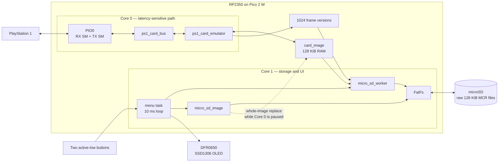
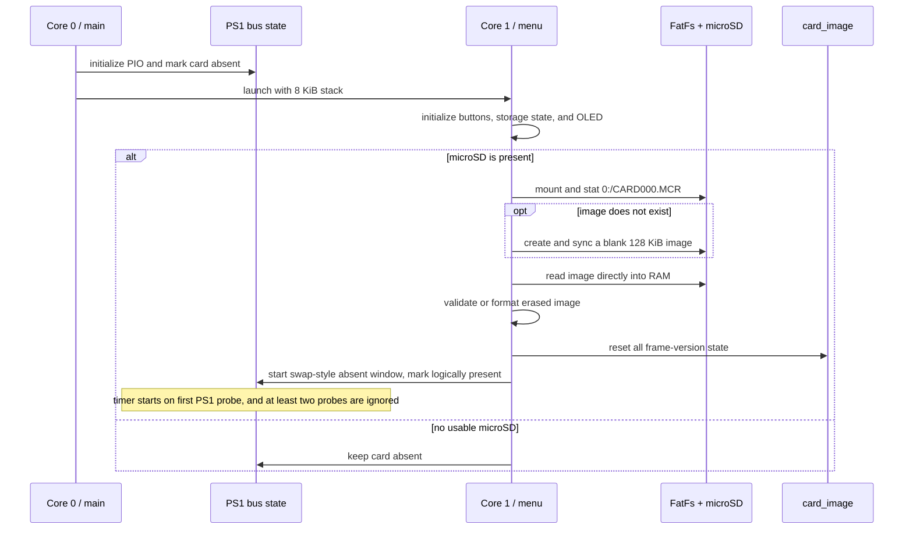
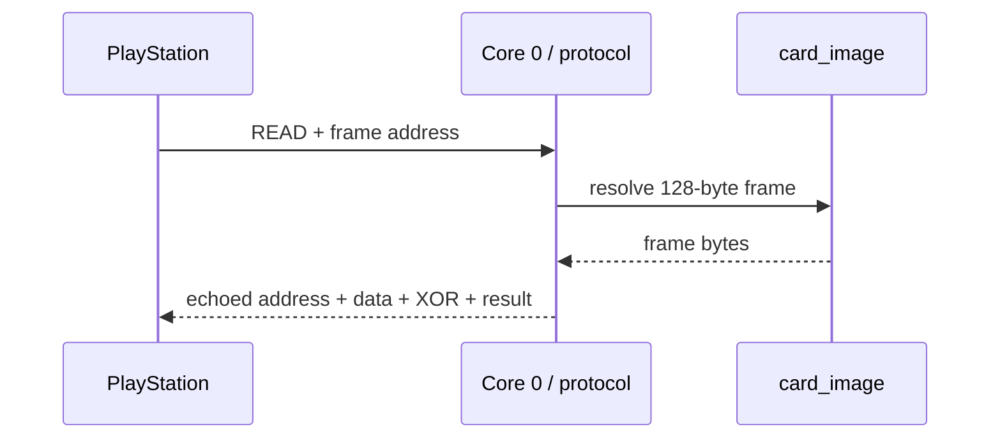
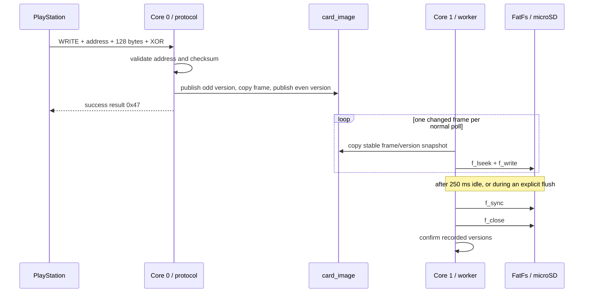

# Architecture

## Supported runtime

The runtime described here is the firmware that currently builds for the Raspberry Pi Pico 2 W (`PICO_BOARD=pico2_w`). The custom RP2350 PCB is a separate, unassembled hardware design and is not yet a compatible firmware target; see [hardware.md](hardware.md).

## Runtime overview

Normal PS1 reads and writes never call FatFs. Image activation is the exception to the usual ownership pattern: Core 1 replaces the complete RAM image only after a pause handshake has stopped Core 0 from exposing it.

## Core 0: PS1 interface

Core 0:

- detects the falling edge of active-low `CS`,
- disables its interrupts for one active transaction,
- dispatches READ, WRITE, and STATUS commands,
- exchanges bytes through two PIO0 state machines,
- reads or commits one 128-byte RAM frame,
- releases DATA and ACK, waits up to 5 ms for `CS` to rise, and re-arms PIO,
- services pause requests between transactions.

The infinite service loop and called protocol hot-path functions use `__not_in_flash_func`. This places them in SRAM so Core 0 does not need to fetch those instructions through XIP while Core 1 executes filesystem and UI code from flash.

The code does not establish a measured worst-case latency guarantee. Physical timing remains an outstanding validation item.

Relevant sources:

- [`firmware/main.c`](../firmware/main.c)
- [`firmware/ps1/ps1_card_bus.c`](../firmware/ps1/ps1_card_bus.c)
- [`firmware/ps1/ps1_card_bus.pio`](../firmware/ps1/ps1_card_bus.pio)
- [`firmware/ps1/ps1_card_emulator.c`](../firmware/ps1/ps1_card_emulator.c)

## Core 1: storage and UI

Core 1 runs `menu_task_run()` on an explicitly allocated 8 KiB stack. Its loop executes approximately every 10 ms and handles:

- microSD presence, debounce, retry, and health probing,
- one normal persistence-worker step per loop,
- explicit full flushes before selected image operations,
- image creation, listing, activation, deletion, and save-directory reads,
- button debounce and menu state,
- OLED updates and its 30-second idle timeout.

A normal worker poll fetches at most one changed frame. Once there are no more immediately available frames, it waits for 250 ms of write inactivity before `f_sync()` and `f_close()`.

Core 1 does not currently sleep in `__wfe()`. Core 0 emits `__sev()` after a frame commit, but the present menu loop discovers work by polling.

Relevant sources:

- [`firmware/menu/`](../firmware/menu/)
- [`firmware/micro_sd/`](../firmware/micro_sd/)
- [`firmware/drivers/oled.c`](../firmware/drivers/oled.c)

## Startup sequence

The initial image path is hard-coded in `main.c`. The previously selected image is not restored after a restart.

## Card-image model

| Property | Current value |
| --- | ---: |
| Frame size | 128 bytes |
| Frame count | 1024 |
| RAM image size | 131,072 bytes (128 KiB) |
| Supported file representation | raw 128 KiB image with a `.MCR` extension |
| Initial path | `0:/CARD000.MCR` |

The RAM buffer is authoritative for the current emulation session. A successful console WRITE is immediately visible to a subsequent READ, but it is not yet durable on microSD.

## Read and write paths

### Console READ

No filesystem operation occurs in this path.

### Console WRITE

## Module boundaries

| Module | Responsibility |
| --- | --- |
| `main` | startup, Core 1 stack/launch, and the Core 0 bus-service loop |
| `ps1_card_bus` | transaction framing, PIO transport, commands, status flags, logical presence, and pause/swap gating |
| `ps1_card_emulator` | RAM access, protocol checksum, frame publication, snapshot, confirmation, and rollback markers |
| `micro_sd` | card detect, mount state, active path/name, result state, and FatFs reset |
| `micro_sd_worker` | incremental frame writes, idle batching, sync/close, and worker-local recovery |
| `micro_sd_image` | raw-image validation/formatting, catalog, save metadata, activation, and deletion |
| `menu_*` | Core 1 orchestration, storage lifecycle, controls, screen state, and display power policy |
| `oled` | SSD1306-style framebuffer and SPI transfers for the current DFR0650 development module |
| `hardware_config` | current Pico 2 W pin and peripheral configuration |
| `app_log` | mutex-protected UART log formatting |

## Design consequences

- The 128 KiB image, three 1024-entry `uint32_t` version arrays, and worker bookkeeping consume a material amount of RP2350 SRAM.
- Normal console writes never wait for Core 1.
- Storage can lag RAM, and a reported PS1 WRITE success is not a power-loss guarantee.
- Whole-image changes require a global pause rather than the per-frame snapshot scheme.
- The Core 0/Core 1 split reduces direct interference, but target timing and XIP behavior still require physical measurement.
