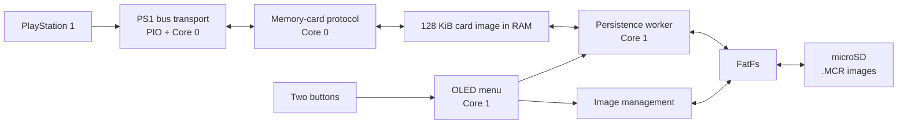
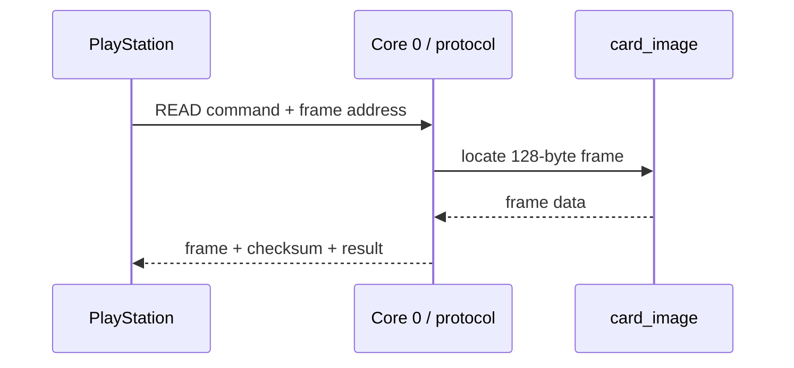
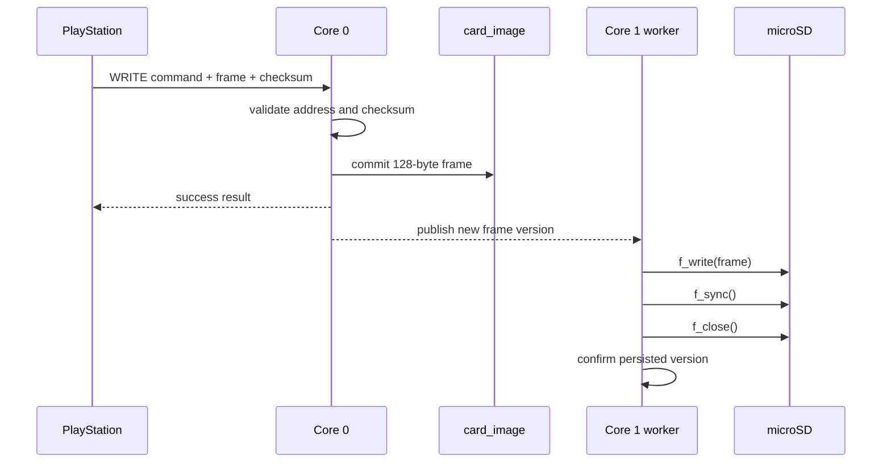

# Architecture

## Overview

PS-microCard separates latency-sensitive PlayStation communication from slower storage and user-interface work. The current firmware target is an RP2350-based Raspberry Pi Pico 2 W, using both processor cores and RP2350 PIO.

## Core responsibilities

### Core 0 — PlayStation interface

Core 0 owns the real-time path:

- detects memory-card transactions through `CS`,
- executes the PS1 memory-card protocol,
- uses two PIO state machines for serial receive/transmit,
- reads and writes the in-memory card image,
- publishes changed 128-byte frames for Core 1,
- temporarily pauses only when Core 1 must replace the complete active image.

The infinite bus service loop is marked `__not_in_flash_func`, as are the hot-path functions it calls. This keeps the transaction path in SRAM so Core 1 can execute FatFs code from external flash without stalling Core 0 instruction fetch.

During one active PS1 transaction, interrupts are disabled on Core 0 so unrelated USB/timer interrupts cannot insert latency into the byte exchange.

Relevant code:

- [`firmware/main.c`](../firmware/main.c)
- [`firmware/ps1/ps1_card_bus.c`](../firmware/ps1/ps1_card_bus.c)
- [`firmware/ps1/ps1_card_bus.pio`](../firmware/ps1/ps1_card_bus.pio)
- [`firmware/ps1/ps1_card_emulator.c`](../firmware/ps1/ps1_card_emulator.c)

### Core 1 — storage and UI

Core 1 handles operations that can tolerate higher and less predictable latency:

- microSD card lifecycle,
- FatFs operations,
- incremental persistence of changed frames,
- creation/listing/deletion of `.MCR` images,
- parsing save-directory metadata,
- OLED rendering,
- button input and menu control.

Core 1 uses an explicitly enlarged 8 KiB stack because FatFs requires more stack than the default Core 1 allocation used by the Pico SDK.

Relevant code:

- [`firmware/micro_sd/`](../firmware/micro_sd/)
- [`firmware/menu/`](../firmware/menu/)
- [`firmware/drivers/oled.c`](../firmware/drivers/oled.c)

## Card image model

A standard PS1 memory card is represented as:

| Property | Value |
| --- | ---: |
| Frame size | 128 bytes |
| Frame count | 1024 |
| Total image size | 131,072 bytes (128 KiB) |
| Storage format used by the project | `.MCR` |

The full active card image lives in the global `card_image` RAM buffer. This is deliberate: reads and writes from the PlayStation do not require an SD-card transaction.

A successful console write therefore has two separate milestones:

1. **visible in RAM** — immediately available to subsequent PS1 reads,
2. **durable on microSD** — confirmed only after the storage worker has written, synchronized, and closed the file successfully.

The distinction is central to the persistence design described in [persistence.md](persistence.md).

## Main data flows

### Console read

No filesystem access is required in this path.

### Console write

This lets the console observe the new value immediately without waiting for SD latency.

## Module boundaries

| Module | Responsibility |
| --- | --- |
| `ps1_card_bus` | PS1 transaction framing, PIO transport, command dispatch, card-present state |
| `ps1_card_emulator` | RAM image access, checksum, changed-frame publication and version tracking |
| `micro_sd_worker` | Incremental frame writes, batching, sync/close, storage recovery |
| `micro_sd_image` | `.MCR` creation/validation, image catalog, save metadata, activation/deletion |
| `menu` | Core 1 task loop and user interaction |
| `oled` | Display driver and status screens |
| `hardware_config` | GPIO and peripheral configuration |

## Design trade-offs

### Full image in RAM

**Benefit:** deterministic PS1 read/write access independent of SD-card latency.

**Cost:** 128 KiB of SRAM is permanently reserved for the active card image.

### Background persistence

**Benefit:** console writes do not block on FatFs.

**Cost:** a short interval exists in which data is visible to the console but not yet durable on storage. The firmware tracks this state explicitly and retries unconfirmed frames after recoverable errors.

### Core split instead of a single event loop

**Benefit:** filesystem and OLED work cannot directly occupy the processor servicing PS1 transactions.

**Cost:** image state and card lifecycle require explicit cross-core synchronization.
