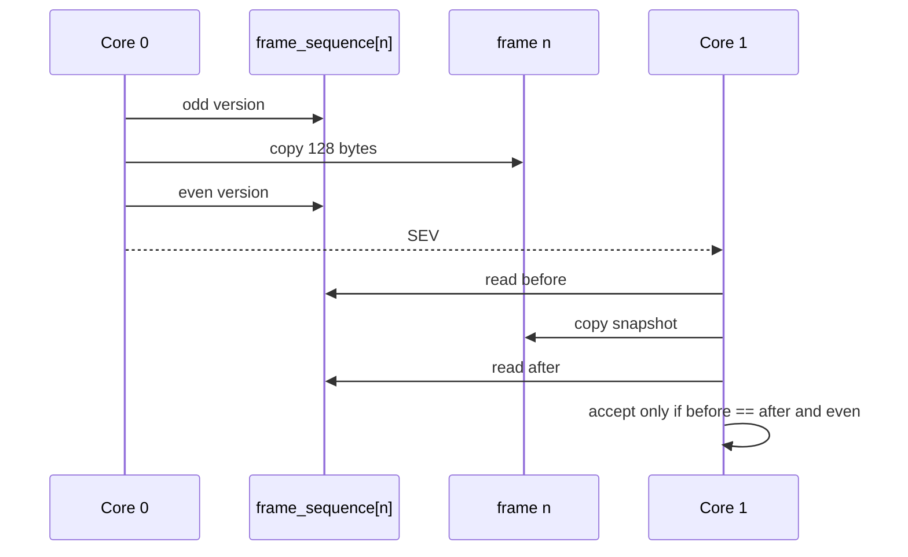

# Concurrency and synchronization

## Core split

The RP2350 cores have deliberately different responsibilities:

| Core | Primary responsibilities |
| --- | --- |
| Core 0 | PS1 bus, protocol parsing, RAM card reads/writes |
| Core 1 | FatFs, microSD persistence, image management, OLED, buttons |

The goal is not simply parallelism. The split keeps unpredictable filesystem/UI execution out of the latency-sensitive console path.

## Shared card image

`card_image` is a 128 KiB array shared between both cores.

The access pattern is asymmetric:

- Core 0 reads frames for PS1 READ commands and is the only core that commits normal PS1 frame writes.
- Core 1 reads stable snapshots of changed frames for persistence.
- Core 1 replaces the complete image only during an explicit image switch while Core 0 is paused and the card is marked absent.

This ownership model avoids a global mutex on every PS1 transaction.

## Per-frame sequence numbers

Each frame has a 32-bit sequence number written by Core 0.

For a commit:

```text
even N
  -> store N+1 (odd: update in progress)
  -> copy 128 bytes
  -> store N+2 (even: stable)
```

Core 1 snapshots only an even, unchanged sequence. The algorithm is conceptually similar to a small per-frame seqlock with a single writer.



## Why no mutex in the hot path

Using a cross-core mutex for every frame read/write could make bus latency depend on storage-side scheduling.

Instead:

- Core 0 never waits for Core 1 when committing an ordinary frame,
- Core 1 tolerates a conflicting write by retrying the snapshot,
- changed frames are discovered by scanning version numbers,
- `__sev()` wakes Core 1 when a new frame is published.

The result is a non-blocking producer path for normal PS1 writes.

## Observed vs confirmed versions

Core 1 tracks two additional arrays:

- `observed_sequence` — versions already fetched for attempted persistence,
- `confirmed_sequence` — versions known to have passed the storage durability boundary.

After a storage failure:

```text
observed_sequence = confirmed_sequence
```

This makes all newer RAM versions pending again without requiring Core 0 to replay the original console transactions.

## Image-switch pause handshake

Replacing all 128 KiB of `card_image` cannot use the ordinary per-frame snapshot model because Core 1 is intentionally changing the whole active image.

Core 1 therefore requests a bus pause:

1. set `ps1_pause_requested`,
2. Core 0 completes/release its current transaction state and sets `ps1_pause_active`,
3. Core 1 flushes and replaces the active image,
4. Core 1 releases the pause,
5. Core 0 re-arms the PIO transaction state.

The pause handshake is used only for operations requiring a global card-image boundary, not for normal frame persistence.

## Flash/XIP interaction

RP2350 firmware executes most code from external flash through XIP. Filesystem work on Core 1 can therefore interact with flash availability/latency.

To protect the critical bus path, the Core 0 service loop and relevant PS1 hot-path functions are placed in SRAM using `__not_in_flash_func`.

This is a design choice worth validating under worst-case storage/UI load once the target hardware is available.

## Interrupt handling

Core 0 disables interrupts for the duration of one active PS1 transaction. The intent is to prevent timer or USB-related handlers from interrupting byte timing.

Interrupts are restored immediately after the transaction has ended and the bus has been prepared for the next one.

## Concurrency invariants

The implementation is designed around the following invariants:

1. Core 0 is the only normal producer of PS1 frame changes.
2. Core 1 never persists a snapshot that changed while it was being copied.
3. A frame is not considered durable until Core 1 confirms its exact version.
4. A storage failure requeues every version newer than the last confirmed one.
5. The console cannot access the RAM buffer while Core 1 is replacing the complete active image.

These invariants are exercised by both unit tests and end-to-end pipeline tests.
