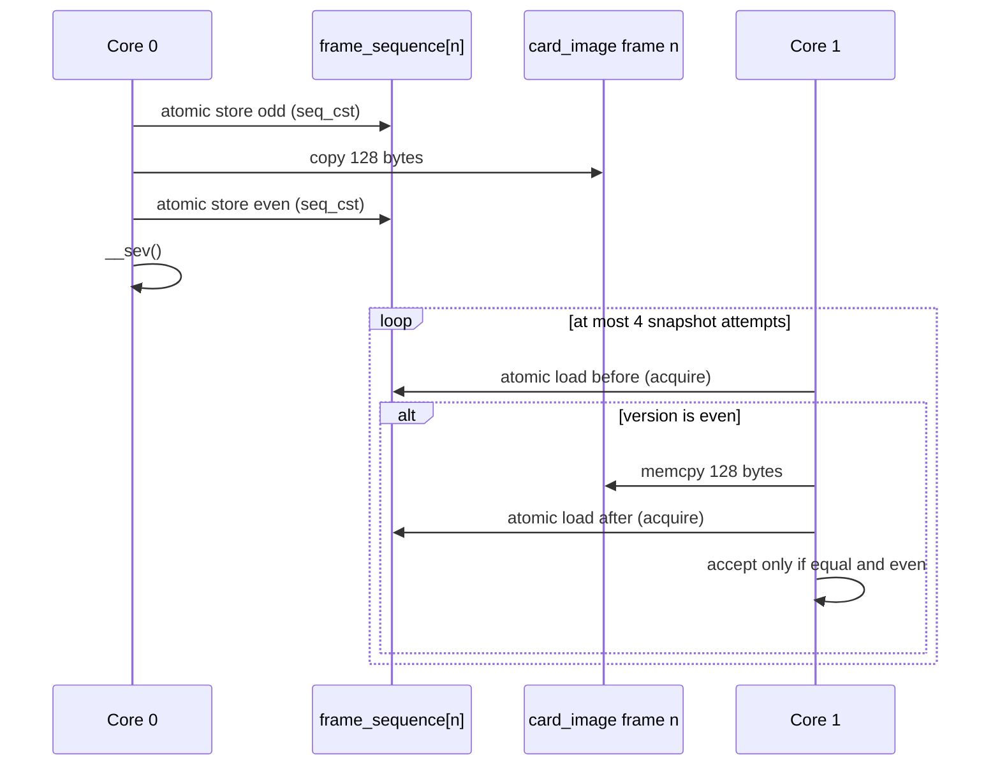
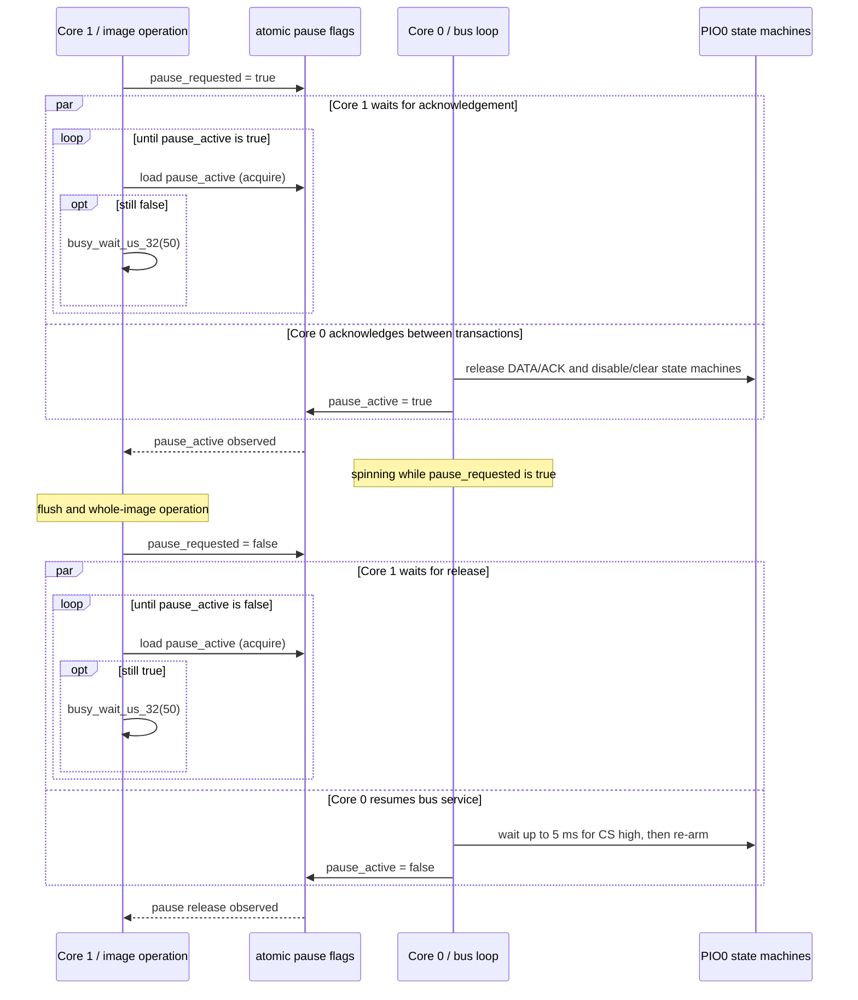

# Concurrency and synchronization

## Core ownership

| State or operation | Normal owner |
| --- | --- |
| PS1 transaction and frame commit | Core 0 |
| Stable frame snapshot and persistence bookkeeping | Core 1 |
| FatFs, image management, menu, OLED, buttons | Core 1 |
| Complete `card_image` replacement | Core 1, only while Core 0 has acknowledged a pause |
| Version-state initialization | Core 1 at startup/image activation, while the card is not exposed |

There is no scheduler or RTOS. Core 0 spins in the PS1 service loop; Core 1 runs the menu/storage loop with a 10 ms busy wait between iterations.

## Shared RAM image

`card_image` is a 128 KiB array shared by both cores.

- Core 0 reads frames for PS1 READ and commits ordinary PS1 WRITE data.
- Core 1 copies stable changed-frame snapshots for persistence.
- Core 1 may overwrite the entire array while loading an image, but only during the pause handshake and while the logical card is absent.

Normal frame access does not use a global mutex.

## Per-frame sequence protocol

Each of the 1024 frames has a 32-bit `frame_sequence`. A Core 0 commit advances it twice:

```text
stable even N
    -> N + 1 (odd: copy in progress)
    -> copy 128 bytes
    -> N + 2 (even: stable)
```

The increment intentionally wraps modulo 2³². The implementation is tested across `UINT32_MAX` to zero.



If four attempts cannot obtain a stable copy, that candidate is skipped for the current scan. `ps1emu_take_changed_frame()` continues scanning other frames and a later worker poll can try again.

## Discovery and polling

`ps1emu_take_changed_frame()` scans from a rotating cursor and returns at most one changed frame per call. `micro_sd_save_worker_poll()` calls it once, so normal operation writes at most one frame per approximately 10 ms menu iteration. `micro_sd_save_worker_flush()` loops until no changed frame remains.

`ps1emu_commit_frame()` calls `__sev()`, but the current Core 1 code contains no `__wfe()`. The event instruction therefore does not currently provide the wake-up mechanism described by older comments; polling does.

## Observed and confirmed versions

Core 1 maintains:

- `observed_sequence[n]` — the stable version most recently taken by the worker,
- `confirmed_sequence[n]` — the version accepted only after a successful `f_sync()` and `f_close()` batch.

`ps1emu_rollback_unconfirmed_frames()` performs:

```text
observed_sequence = confirmed_sequence
scan_cursor = 0
```

This makes newer RAM versions discoverable again only if the RAM image and version arrays remain intact.

The worker-level retry tests preserve RAM and explicitly reinitialize the worker. The production menu's recovery path instead reloads `0:/CARD000.MCR` into RAM and calls `ps1emu_storage_state_init()`. That top-level behavior discards the requeued version state; it is documented as a current limitation rather than a persistence guarantee.

## Image-switch pause handshake



A request made during a transaction is acknowledged only after Core 0 leaves that transaction path. This handshake has no timeout on the Core 1 side; a failed or stopped Core 0 would block the requester.

The handshake is used for image activation and deletion. It is not used for normal background frame persistence.

## Logical card presence and swap gating

`ps1_card_present` is a software gate checked by Core 0 before dispatching a transaction.

- `false` causes transactions to be ignored and resets the protocol status to power-on.
- A successful startup or image activation sets it to `true` but also starts a swap-absent policy.
- The 1.5-second absent timer begins on the first ignored probe, not at the moment Core 1 requests the window.
- At least two probes are ignored; the third or a later probe is accepted only after the time condition has also elapsed.

Logical absence is not the same as physically disconnecting the bus. DATA and ACK are released and the transaction handler is skipped.

## Interrupts and XIP

Core 0 saves and disables interrupts from the detected `CS` falling edge until the transaction has ended, lines have been released, and PIO has been prepared for the next transaction. Interrupts are then restored.

The service loop and protocol hot path are copied to SRAM with `__not_in_flash_func`. This reduces dependence on external-flash instruction fetch while Core 1 is running FatFs, but no repository evidence establishes worst-case timing under real storage, OLED, UART, or flash load.

## Properties covered by host tests

Host tests cover:

- stable snapshots and version wraparound,
- latest-version selection and rollback/confirmation bookkeeping,
- storage batching and replay when the test harness preserves RAM,
- pause-gated image replacement through a UNIT_TEST auto-acknowledged pause,
- logical absent delay/probe behavior.

They do not execute real dual-core interleavings, the production PIO state machines, interrupt masking, or XIP contention.
