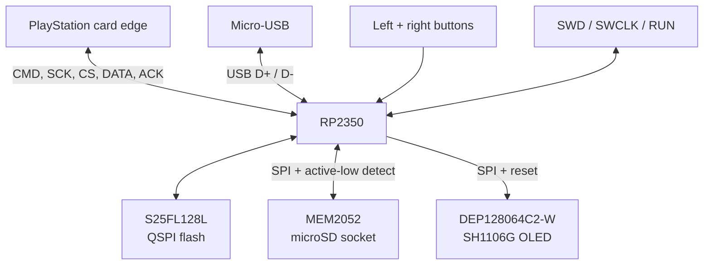
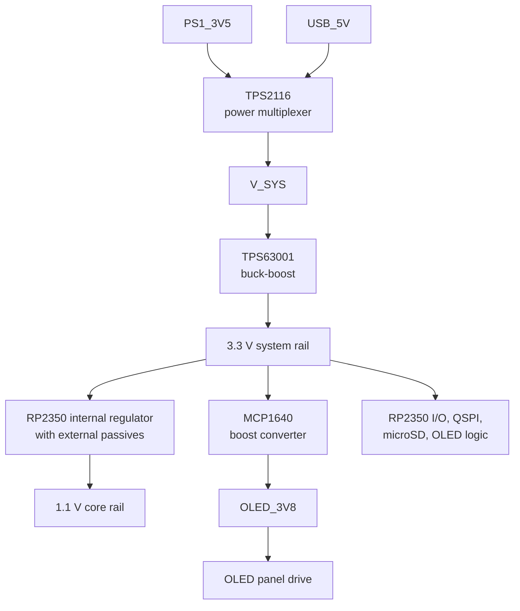
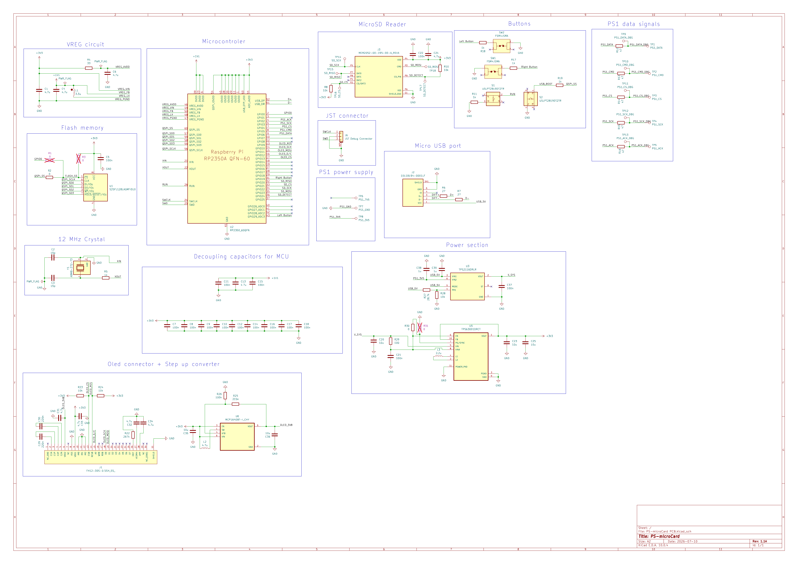
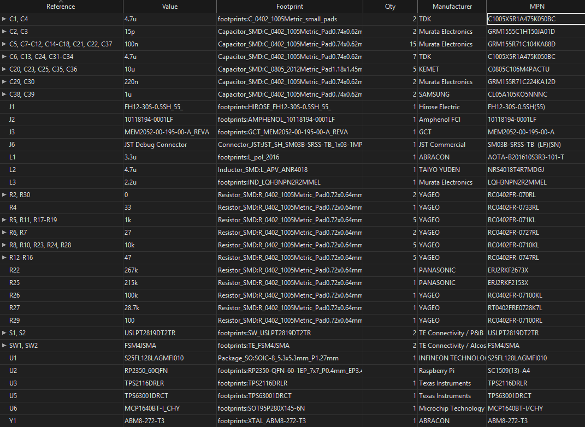

# Hardware architecture and platform status

## Two different hardware targets

The repository currently contains two hardware contexts that must not be conflated:

1. a Pico 2 W development setup used by the current firmware configuration and shown in the README;
2. a custom RP2350 PCB designed in KiCad but not yet assembled or validated.

`CMakeLists.txt` selects `pico2_w`, and [`hardware_config.h`](../firmware/board/hardware_config.h) contains the development wiring. The custom PCB uses different GPIO assignments and a different OLED controller, so the current binary is not a custom-board firmware image.

## Platform comparison

| Area | Current Pico 2 W firmware | Custom PCB design |
| --- | --- | --- |
| MCU/board definition | Pico 2 W, `pico2_w` SDK definition | bare RP2350; no project board definition yet |
| Program flash | Pico 2 W onboard flash | S25FL128L external QSPI flash |
| PS1 GPIOs | DATA 2, CMD 3, CS 4, SCK 5, ACK 6 | DATA 6, CMD 5, CS 4, SCK 3, ACK 2 |
| microSD GPIOs | SPI0: MISO 16, CS 17, SCK 18, MOSI 19, detect 20 | MISO 20, CS 21, SCK 22, MOSI 23, detect 24 |
| Card-detect active level | high, for the documented Pololu 2597 setup | low: MEM2052 normally-open switch closes detect to GND on insertion |
| OLED | DFRobot DFR0650, SSD1306, no exposed reset | DEP128064C2-W panel, SH1106G, reset on GPIO 9 |
| OLED data GPIOs | SPI1: SCK 10, MOSI 11, D/C 12, CS 13 | same four data/control GPIOs |
| Buttons | NEXT 8, SELECT 9 | left button 29, right button 19 |
| Hardware status | breadboard prototype pictured; no committed measurement data | layout complete; unassembled and unvalidated |

The DFR0650 controller/interface is documented by [DFRobot](https://wiki.dfrobot.com/dfr0650/). The custom panel controller is identified in the repository's [DEP128064C2-W datasheet](../hardware/datasheets/DEP128064C2-W.pdf).

## Current development wiring

### PS1 bus

| Signal | Pico 2 W GPIO | Direction from emulator |
| --- | ---: | --- |
| DATA | 2 | open-drain output |
| CMD | 3 | input |
| CS | 4 | input |
| SCK | 5 | input |
| ACK | 6 | open-drain output |

DATA and ACK are asserted by driving low and released to high impedance. External pull-up behavior and voltage compatibility must be validated on the actual console connection.

The PIO source has compile-time layout assumptions for this mapping:

```text
CS  = CMD + 1
SCK = CMD + 2
CS  = DATA + 2
SCK = DATA + 3
```

The custom PCB's reversed PS1 assignment does not satisfy those assertions. Supporting it requires a changed PIO mapping/program, not just recompiling the existing constants.

### microSD

| Signal | Pico 2 W GPIO |
| --- | ---: |
| MISO | 16 |
| CS | 17 |
| SCK | 18 |
| MOSI | 19 |
| card detect | 20 |

The current configuration uses SPI0 at 8 MHz and expects card-detect high when present. The custom socket's switch is pulled up and grounds `SD_DETECT` when a card is inserted, so its configuration must use the opposite present level.

### OLED

| Signal | Pico 2 W GPIO |
| --- | ---: |
| SCK | 10 |
| MOSI | 11 |
| D/C | 12 |
| CS | 13 |

The current driver uses SPI1 at 4 MHz, SSD1306-style commands, a 128×64 page framebuffer, and no reset pin. It targets the DFR0650 development module.

The custom DEP128064C2-W uses an SH1106G and exposes `OLED_RES` on GPIO 9. The current driver neither toggles that reset nor handles SH1106G-specific display-RAM/column behavior. Custom-board OLED support is therefore pending even though the four SPI/control nets otherwise match.

### Buttons

Current buttons are active-low inputs with internal pull-ups:

| Action in firmware | Pico 2 W GPIO | Intended custom-PCB control |
| --- | ---: | --- |
| NEXT / left button | 8 | GPIO 29 |
| SELECT / right button | 9 | GPIO 19 |

GPIO 9 is also the custom PCB's OLED reset, which is another reason a separate board configuration is required.

## Custom-board block diagram



This diagram describes schematic connectivity, not verified operation.

## Custom-board power tree



The diagram omits protection, decoupling, feedback networks, series components, and test points. The KiCad schematic is the source of truth for component-level connectivity.

## Custom-board port work still required

Before the custom board can be called supported, the repository needs at least:

- a Pico SDK board definition for the bare RP2350 and S25FL128L flash;
- custom pin definitions for PS1, microSD, card detect, buttons, and OLED reset;
- a PIO program/configuration compatible with the custom PS1 pin ordering;
- active-low card-detect behavior;
- SH1106G initialization, reset, and column addressing;
- a successful custom-target build;
- electrical bring-up and regulator checks;
- PS1 DATA/ACK voltage and timing measurements;
- microSD, OLED, USB, SWD, button, and power-source tests.

## Custom PCB schematic (KiCad)

<p align="center">

</p>
<p align="center">
<i>Component-level schematic of the unassembled custom RP2350 PCB, including the MCU, storage, display, controls, PS1 interface, USB, and power sections.</i>
</p>

## Custom PCB bill of materials (BOM)

<p align="center">

</p>
<p align="center">
<i>Design-stage BOM for the unassembled custom RP2350 PCB, grouped by reference designator with values, quantities, footprints, manufacturers, and manufacturer part numbers.</i>
</p>
