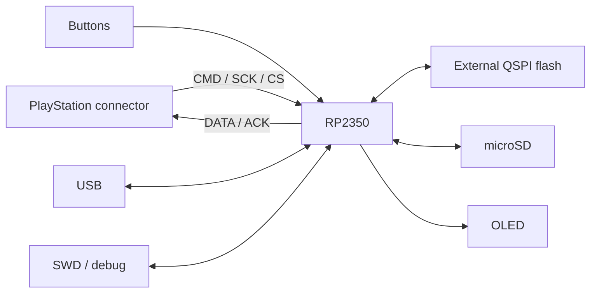
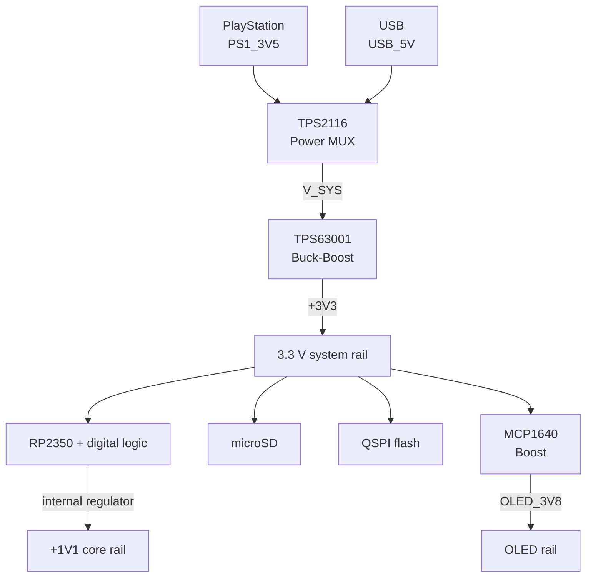

# Hardware architecture

## Status

The custom PS-microCard PCB is designed in KiCad but has not yet been assembled. The firmware currently targets the Raspberry Pi Pico 2 W for development.

This page therefore documents the intended board architecture. Electrical behavior, regulator performance, signal integrity, current consumption, and PS1 bus timing remain **pending physical validation**.

## Board-level overview

The custom design integrates:

- RP2350 microcontroller,
- external QSPI flash,
- PlayStation memory-card connector/interface,
- microSD card interface,
- SPI OLED interface,
- two-button user interface,
- USB interface and debug access,
- dual-source system power path,
- dedicated boosted OLED rail.

The complete editable design is available in [`hardware/`](../hardware/).

## Power tree

The schematic uses a separate block-level power path rather than powering all rails directly from one connector.

### Rationale

The board can receive power from the PlayStation-side supply (`PS1_3V5`) or USB (`USB_5V`). A TPS2116 power multiplexer feeds the common `V_SYS` rail. A TPS63001 buck-boost stage then generates the regulated 3.3 V system rail across the expected source range.

A separate MCP1640 boost converter generates the `OLED_3V8` rail required by the display section.

The diagram intentionally omits passives and component-level feedback networks. The schematic remains the source of truth for exact regulator configuration.

## Digital interfaces

### PlayStation bus

The firmware uses five PS1 signals:

| Signal | Development GPIO |
| --- | ---: |
| DATA | GPIO 2 |
| CMD | GPIO 3 |
| CS | GPIO 4 |
| SCK | GPIO 5 |
| ACK | GPIO 6 |

DATA and ACK are treated as open-drain outputs in firmware: the output latch is kept low, and the line is asserted/released by changing pin direction.

The custom PCB includes debug-labelled versions of the PS1 signals in the schematic (`PS1_*_DBG`) to make bring-up and logic-analyzer access easier.

### microSD

The development configuration uses SPI0:

| Signal | GPIO |
| --- | ---: |
| MISO | 16 |
| CS | 17 |
| SCK | 18 |
| MOSI | 19 |
| Card detect | 20 |

The firmware configures an 8 MHz SPI clock and uses a dedicated card-detect input.

### OLED

The development configuration uses SPI1 for a 128×64 SSD1306-compatible OLED:

| Signal | GPIO |
| --- | ---: |
| SCK | 10 |
| MOSI | 11 |
| D/C | 12 |
| CS | 13 |

The firmware configures a 4 MHz SPI clock.

### User input

Two active-low buttons with internal pull-ups are assigned to GPIO 8 and GPIO 9 in the development configuration.

## Memory and boot support

The KiCad design contains an RP2350 device and external QSPI flash. Relevant schematic nets include `QSPI_SCLK`, `QSPI_SD0..3`, `QSPI_SS`, `USB_BOOT`, `RUN`, `SWD`, and `SWCLK`.

These provide the normal boot/program/debug infrastructure expected by an RP2350 board.