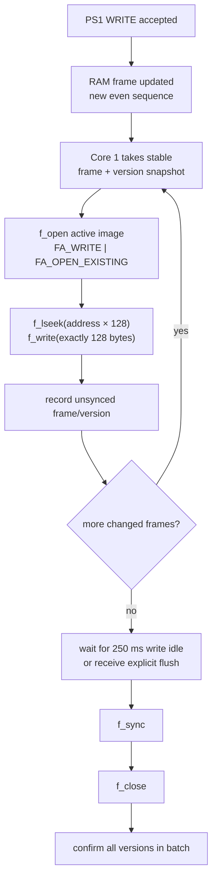
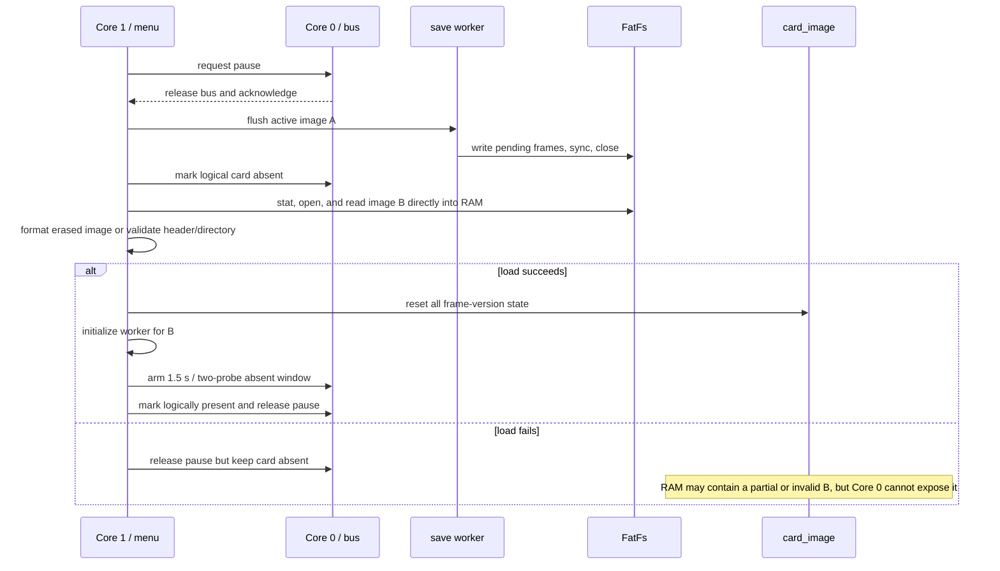

# Persistence, images, and recovery

## Current persistence contract

A successful PS1 WRITE means that a validated 128-byte frame has been committed to `card_image`. It does not mean that the data has reached microSD.

| Milestone | What has happened | What it proves |
| --- | --- | --- |
| PS1 result `0x47` | RAM frame and its even version were published | A following PS1 READ can see the new data |
| successful `f_write()` | FatFs accepted 128 bytes at the frame offset | The version is still unconfirmed |
| successful `f_sync()` | FatFs reported a synchronization success | The worker still waits for close |
| successful `f_close()` after sync | The batch is closed and versions are marked confirmed | The firmware's conservative durability boundary was crossed |

The last row is the firmware's accounting rule, not a guarantee against every controller, flash-media, or sudden-power-loss behavior.

## Incremental write path

The file remains open while a batch is accumulating. A normal poll writes at most one frame; a flush drains all currently discoverable frames and then synchronizes immediately.

If the same frame changes again before confirmation, the unsynced entry is updated to the latest version written. If a still newer RAM version exists, it remains discoverable for another write.

## Worker error handling

Open, seek, short-write/write, sync, close, and snapshot-fetch failures call the worker's recovery path. That path:

1. records the error,
2. marks the logical PS1 card absent,
3. copies confirmed versions back into observed versions,
4. clears the worker's unsynced table,
5. closes the file if it was open,
6. resets FatFs and SD-library state,
7. shows an OLED SD error,
8. busy-waits for 1 second before returning.

Physical removal is handled similarly by `micro_sd_handle_card_unavailable()`, although that function resets the worker state directly.

## Image format

The project supports raw PlayStation card dumps with these properties:

| Property | Requirement |
| --- | --- |
| File size | exactly 131,072 bytes |
| Extension used by the UI | case-insensitive `.MCR` |
| Header frame | bytes 0..1 are `MC` and byte 127 is XOR of bytes 0..126 |
| Directory frames | frames 1..15 have an accepted state, zero reserved bytes 1..3, and a valid XOR |
| Extra container/header formats | not supported |

Validation checks the header and directory area; it does not semantically validate all save-data frames.

A file whose complete 128 KiB contents are all `0x00` or all `0xFF` is treated as erased media. Loading it rewrites the file into the project's blank-card format, synchronizes/closes it, and replaces RAM with the same formatted image.

The catalog scan initially filters by extension and exact size. Full header/directory validation happens only when an image is loaded, so a size-correct but malformed image may appear in the browser and then fail activation.

## Image activation

The timer starts at the first probe after release. The implementation ignores at least two probes and accepts a later one only once 1.5 seconds has elapsed.

## Deletion

Deleting a non-active image pauses Core 0, flushes the active image, deletes the selected file, and releases the pause.

Deleting the active image first searches the visible catalog for another image. If none exists, it creates a new blank image. It then activates that fallback through the normal pause/load path before unlinking the old file.

A size-correct but format-invalid fallback can cause activation, and therefore deletion, to fail.
