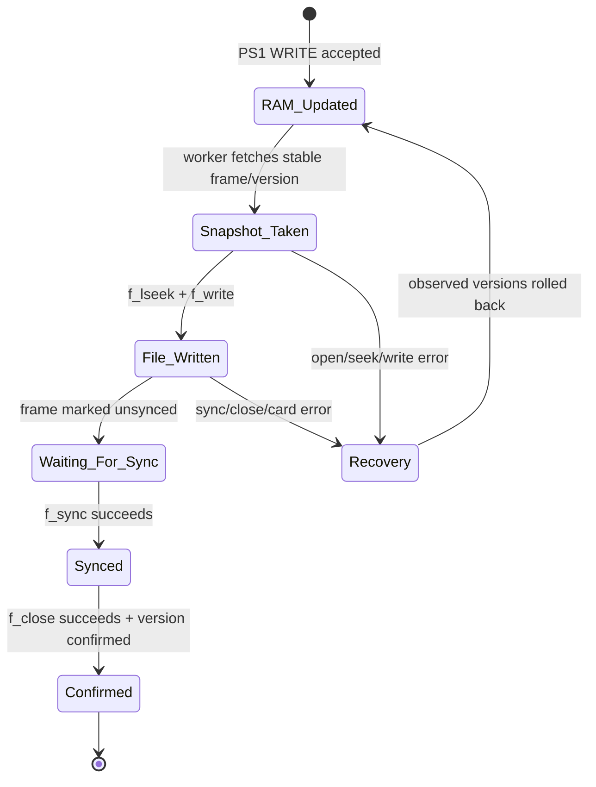
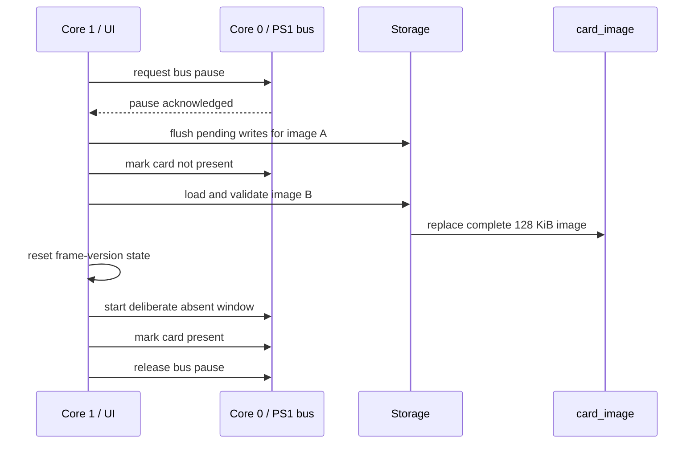

# Persistence and failure recovery

## Why persistence is asynchronous

The PlayStation bus must not wait for microSD latency. A successful PS1 WRITE therefore updates the in-memory card image first; Core 1 persists changed frames in the background.

This creates two different definitions of “written”:

- **RAM-visible** — the new frame is immediately returned by subsequent PS1 READ commands,
- **storage-confirmed** — the frame version has survived `f_write()`, `f_sync()`, and `f_close()` successfully.

The firmware tracks these states separately.

## Frame version model

Each of the 1024 frames has three logical version markers:

| Marker | Owner | Meaning |
| --- | --- | --- |
| `frame_sequence` | Core 0 | newest RAM version; odd while a frame copy is in progress, even when stable |
| `observed_sequence` | Core 1 | newest version already fetched by the persistence worker |
| `confirmed_sequence` | Core 1 | newest version confirmed durable after sync/close |

A new PS1 write changes only one 128-byte frame. This allows the worker to update the corresponding offset in the `.MCR` file instead of rewriting the full 128 KiB image.

## Stable snapshot

Core 1 copies a changed frame using a sequence-check pattern:

```text
read version -> copy 128 bytes -> read version again
```

The snapshot is accepted only when:

- the version is even before the copy,
- the version is unchanged after the copy,
- the final version is still even.

If Core 0 updates the same frame during the copy, Core 1 retries rather than persisting a torn mixture of old and new bytes.

## Write path



### Incremental writes

For each changed frame, the worker seeks to:

```text
frame_address × 128 bytes
```

and writes exactly one frame.

Several changed frames may be written before one shared sync. The worker waits for an idle period of 250 ms before synchronizing during normal polling. Operations that require a strong boundary, such as switching or deleting an image, call `micro_sd_save_worker_flush()` instead.

## Durability boundary

A successful `f_write()` is intentionally **not** treated as durable storage.

The worker confirms frame versions only after:

1. all pending frame writes succeed,
2. `f_sync()` succeeds,
3. `f_close()` succeeds.

This conservative rule means a sync or close error leaves the affected versions unconfirmed and eligible for replay.

## Recovery after a storage failure

On a storage error, the worker:

1. records the storage error,
2. marks the emulated card absent to the PlayStation,
3. rolls `observed_sequence` back to `confirmed_sequence`,
4. clears temporary unsynced bookkeeping,
5. closes the save file if needed,
6. resets the FatFs/card state,
7. reports the SD error on the OLED,
8. retries only after the storage lifecycle recovers.

Rolling back the observed versions does **not** undo RAM data. Instead it makes every unconfirmed RAM version visible to the worker again, so it can be retried after recovery.

This behavior is tested for open, seek, write, short-write, sync, close, no-space, read-only, and card-removal failures.

## Immediate reads before persistence

Because the RAM image is authoritative for the active emulation session, a PS1 READ immediately after a WRITE returns the new frame even if the SD worker has not run yet.

This is an intentional trade-off: the device remains responsive, while persistence status is tracked independently.

The integration suite contains a dedicated scenario for this behavior.

## Image validation and blank-card creation

`.MCR` images must be exactly 131,072 bytes.

When loading an image, the firmware checks:

- file size,
- `MC` header signature,
- directory entry states,
- directory frame checksums.

A file consisting entirely of `0x00` or `0xFF` is treated as erased media and formatted into a valid blank PS1 card image.

New cards are generated as `CARD000.MCR` through `CARD999.MCR`, selecting the first unused name.

## Safe image switching

Switching from image A to image B is a cross-core operation and must never expose a partially loaded B image to the console.

The implemented sequence is:



After a successful switch, the bus intentionally ignores transactions for approximately 1.5 seconds and at least two probes before exposing the new card. This models a physical remove/reinsert event rather than changing card contents underneath an already-present card.

If loading B fails, the console is not allowed to access a partially replaced RAM image.

## Deleting images

Deleting a non-active image first flushes pending storage work while the PS1 bus is paused.

Deleting the active image first selects another existing image as a fallback. If no other image exists, a new blank image is created and activated before the old file is removed.
