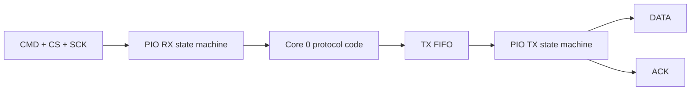

# PlayStation memory-card protocol

## Scope

The firmware implements the PS1 memory-card command flow required for card identification/status, frame reads, and frame writes. The protocol layer is separated from the low-level serial transport so most behavior can be tested on the host.

## Card geometry

The emulated card contains 1024 frames of 128 bytes each:

```text
1024 frames × 128 bytes = 131072 bytes = 128 KiB
```

Frame addresses therefore range from `0` to `1023`.

The shared geometry is defined in [`ps1_card_geometry.h`](../firmware/ps1/ps1_card_geometry.h).

## Implemented commands

After a valid memory-card access byte (`0x81`), the command byte selects the operation.

| Command | Meaning | Firmware handler |
| --- | --- | --- |
| `0x52` | READ | `ps1emu_handle_read()` |
| `0x57` | WRITE | `ps1emu_handle_write()` |
| `0x53` | STATUS / identification | `ps1emu_handle_status()` |

Unknown commands are ignored and the bus lines are released safely.

## READ (`0x52`)

The console supplies a two-byte frame address. For a valid address, the firmware returns:

1. protocol response bytes,
2. echoed frame address,
3. 128 bytes from the active RAM image,
4. XOR checksum,
5. success result `0x47`.

For an out-of-range frame, the firmware returns `0xFF` data and the bad-sector result `0xFF` rather than reading outside the card buffer.

The checksum is calculated as XOR of:

- address low byte,
- address high byte,
- all 128 frame bytes.

## WRITE (`0x57`)

The firmware receives:

- a two-byte frame address,
- exactly 128 data bytes,
- a checksum byte.

The RAM image is changed only if both conditions are true:

1. the frame address is valid,
2. the received checksum matches the calculated checksum.

A failed checksum or invalid frame therefore cannot create a partial RAM update.

On success, `ps1emu_commit_frame()` atomically publishes a complete new frame version to the storage worker. Persistence to microSD happens later on Core 1.

## STATUS (`0x53`)

The status handler returns the fixed identification/status response currently implemented by the emulator:

```text
5A 5D 5C 5D 04 00 00 80
```

The protocol state also tracks power-on and write-error status bits. A successful write clears the power-on/write-error state used by the command exchange.

## PIO transport

Production firmware uses two PIO state machines in `pio0`:



### RX state machine

The RX program:

- waits for active-low `CS`,
- samples one CMD bit per SCK cycle,
- shifts LSB-first bytes into the RX FIFO.

### TX state machine

The TX program:

- receives an already prepared response byte from Core 0,
- generates the ACK pulse,
- shifts the response on DATA LSB-first,
- implements DATA and ACK as open-drain outputs by switching pin direction rather than driving a logic high.

The C code writes an inverted byte to the PIO TX FIFO because a `1` in the PIO output stream means “drive DATA low”, while `0` releases the line.

The two-state-machine design keeps command reception independent of the CPU generating the previous response/ACK sequence.

## Pipelined byte exchange

The first access byte is received without generating an ACK. For subsequent bytes, the next response is queued before the ACK associated with the preceding received byte.

This ordering means that once the console sees ACK, the data for the following byte is already prepared.

Host tests explicitly verify this transport contract for the reference `UNIT_TEST` implementation. The production PIO programs are compiled as part of the firmware build but still require measurement on physical hardware.

## Abort and timeout behavior

A transaction is abandoned if:

- `CS` is released before the transaction completes, or
- a required clock edge does not arrive before the byte timeout.

After each transaction, both PIO state machines are reset and prepared for the next `CS` assertion.

The production byte timeout is currently `500 µs`. This is a defensive timeout value in firmware, **not a measured PS1 timing specification**.

## Timing validation status

The protocol behavior is covered by host tests, including aborts at byte/bit boundaries and timeout behavior. Electrical timing of the production PIO implementation has been documented with a logic analyzer.

See [verification.md](verification.md) for the validation evidence.
