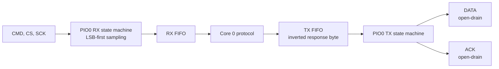

# PlayStation memory-card protocol

## Implemented scope

The firmware accepts memory-card access byte `0x81` and implements three command values:

| Command | Operation | Handler in `ps1_card_bus.c` |
| --- | --- | --- |
| `0x52` | READ one frame | `ps1emu_handle_read()` |
| `0x57` | WRITE one frame | `ps1emu_handle_write()` |
| `0x53` | fixed STATUS/identification response | `ps1emu_handle_status()` |

Other access bytes are rejected without entering a command. Unknown commands after `0x81` receive no command-specific payload and the lines are released.

Core 0 calls the transaction handler only when the logical card-present/swap gate permits it. Host unit tests often call the handler directly, so physical/logical presence is a separate behavior from command parsing.

## Geometry and byte order

| Property | Value |
| --- | ---: |
| Frames | 1024 |
| Bytes per frame | 128 |
| Total | 131,072 bytes |
| Valid frame addresses | 0..1023 |
| Address order on the bus | most-significant byte, then least-significant byte |
| Checksum | XOR of both address bytes and all 128 data bytes |

Geometry constants are shared in [`ps1_card_geometry.h`](../firmware/ps1/ps1_card_geometry.h).

## Common transaction prefix

The implementation is pipelined: a queued card response is associated with the next byte clocked by the console.

| Byte | Console sends | Card queues/returns | Notes |
| ---: | --- | --- | --- |
| 0 | `0x81` | `0xFF` / released DATA | initial receive call does not queue an ACK |
| 1 | command | current protocol status | response is queued before the ACK for the access byte |
| 2 onward | command-specific bytes | command-specific response | every parser exchange requests the pipelined ACK/response path |

The first valid access byte is therefore acknowledged only when Core 0 has already queued the status byte for byte 1. The wording “no ACK on the first call” does not mean that a valid access byte is never acknowledged.

## Protocol status byte

The status byte returned during the command transfer is separate from the fixed `0x53` payload.

| Bit | Value | Current behavior |
| --- | --- | --- |
| power-on | `0x08` | set at initialization, logical removal, and swap start; cleared by a successful WRITE |
| write error | `0x04` | set by invalid address, bad checksum, or commit failure; reported on the next command transfer and then cleared |

Logical removal resets the status byte to power-on. A successful WRITE clears both bits.

## READ (`0x52`)

After the common prefix, the handler:

1. queues `5A 5D`,
2. receives address MSB and LSB while returning zero bytes,
3. queues `5C 5D`,
4. echoes address MSB and LSB,
5. sends 128 data bytes,
6. sends the XOR checksum,
7. sends result `0x47`.

```text
card response after address reception:
5C 5D  addr_msb addr_lsb  data[128]  xor  47
```

For an address outside 0..1023, the firmware sends 128 bytes of `0xFF`, checksum byte `0xFF`, and result `0xFF`. It does not dereference outside `card_image`.

## WRITE (`0x57`)

After `5A 5D`, the handler receives:

- address MSB and LSB,
- exactly 128 data bytes,
- one checksum byte.

It commits RAM only after the full payload has arrived and both address and checksum are valid. Abort or timeout before the checksum cannot create a partial RAM frame.

The trailing response is:

| Condition | Result |
| --- | ---: |
| valid address, checksum, and RAM commit | `0x47` |
| checksum mismatch or internal commit error | `0x43` |
| address outside 0..1023 | `0xFF` |

The result follows `5C 5D`. A successful RAM commit publishes a new frame version for Core 1; it does not wait for microSD.

## STATUS (`0x53`)

The command-specific response is the fixed eight-byte sequence currently present in code:

```text
5A 5D 5C 5D 04 00 00 80
```

This payload is not generated from the mutable power-on/write-error byte.

## Production PIO transport



Both DATA and ACK keep a low output latch. PIO asserts a line by changing its direction to output and releases it by changing direction to input; it does not actively drive a high level.

### RX state machine

The RX program:

- waits for active-low `CS` when armed,
- waits for SCK low and then high,
- samples one CMD bit on that rising transition,
- auto-pushes after eight LSB-first bits.

### TX state machine

The TX program:

- waits for active-low `CS`,
- blocks until Core 0 has placed an inverted byte in the TX FIFO,
- asserts ACK before shifting that prepared response,
- releases ACK,
- changes DATA direction on SCK falling transitions for eight LSB-first bits.

The state machines run from a 2.5 MHz PIO clock. The programmed ACK-low instruction lasts nominally 6 PIO cycles, about 2.4 µs. This is a code-derived value, not a measured bus waveform or established compatibility margin.

The constants `PS1_ACK_PULSE_US` and `PS1_BUS_CLOCK_TIMEOUT_LOOPS` apply to the UNIT_TEST reference bit-bang transport, not the production PIO program.

## Abort, timeout, and reset

The production CPU waits at most 500 µs for each received byte to appear in the RX FIFO. While waiting, it also checks whether `CS` has risen.

On abort or timeout:

- the command handler stops,
- DATA and ACK are released,
- both PIO state machines are disabled and their FIFOs cleared,
- the main loop waits at most 5 ms for `CS` release,
- PIO is initialized for the next transaction once `CS` is high.

The 500 µs byte deadline and 5 ms release deadline are defensive firmware values. They are not documented PS1 timing requirements.

## What host tests establish

Host tests establish command parsing, result values, checksum behavior, frame bounds, byte-boundary abort handling, and the requested pipelined response/ACK ordering.

The `hardware_xfer_*` tests execute a C bit-bang reference compiled only under `UNIT_TEST`. They do not execute `ps1_card_bus.pio`, PIO FIFOs, state-machine synchronization, IRQ masking, or actual GPIO electrical behavior.

## Timing validation status

The production PIO source compiles as part of the firmware build. The repository contains no logic-analyzer capture or recorded physical PlayStation timing evidence. Electrical compatibility and timing margins remain pending; see [verification.md](verification.md).
