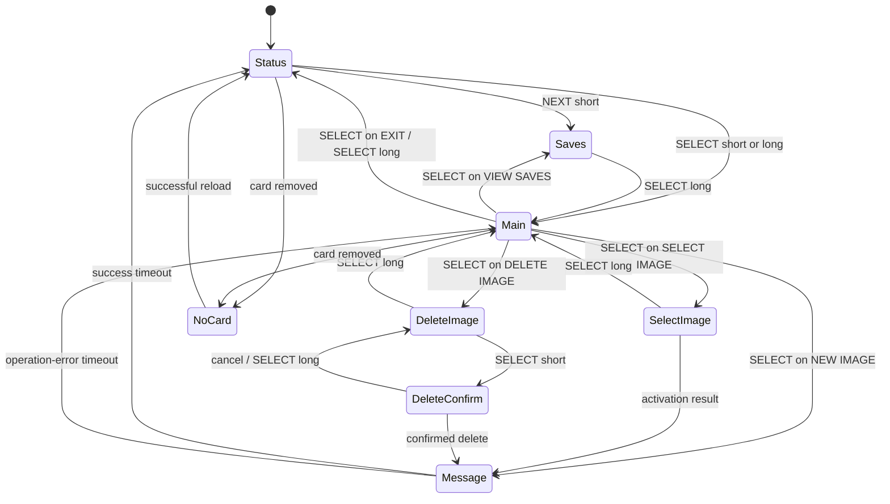

# User interface

## Current hardware and task

The current UI runs on Core 1 and targets a 128×64 DFRobot DFR0650 SSD1306 module over SPI1. It uses two active-low buttons with internal pull-ups.

The menu task also owns storage lifecycle and persistence polling, so UI availability is not required for PS1 protocol execution. If OLED initialization fails, storage and button processing continue, but there is no usable visual feedback.

## Controls

The display abbreviates the buttons as:

- left button (`L.B.`) — NEXT,
- right button (`R.B.`) — SELECT/OK/BACK.

Button debounce is 60 ms. A press held for 700 ms generates a long-press event. Long NEXT events are generated by the input module but are not assigned an action by the current controller.

| Screen | NEXT short | SELECT short | SELECT long |
| --- | --- | --- | --- |
| status | open save list | open main menu | open main menu |
| main menu | next item | choose item | return to status |
| select image | next image | activate image | return to main menu |
| saves | next save | no action | return to main menu |
| delete image | next image | open confirmation | return to main menu |
| delete confirmation | toggle NO/YES | cancel or delete | return to image list |
| transient message | ignored | ignored | ignored |
| no-card/error | ignored | ignored | ignored |

## Main menu

The current items are:

1. `SELECT IMAGE`,
2. `NEW IMAGE`,
3. `VIEW SAVES`,
4. `DELETE IMAGE`,
5. `EXIT`.

Creating a new image first flushes the active worker, creates the first free `CARDxxx.MCR`, and then activates the new image.

Viewing saves flushes pending changes before reading the active file's directory. The screen shows a sanitized directory filename, slot, and derived block count; it does not decode the save title or icon.

## Screen and input state flow

Error messages can return to an image screen rather than always returning to Main; the diagram shows the dominant paths and not every stored `message_return_screen` value.

## Display power behavior

- The OLED turns off after 30 seconds without a framebuffer update or accepted button event.
- The first press while asleep wakes the display and is discarded until the buttons are released.
- A new screen update, SD removal, or SD insertion can wake the display.
- Repeated rendering of identical text does not send the framebuffer again and does not count as activity.

## Storage-dependent behavior

Menu actions are enabled only while `menu_storage_is_ready()` is true.

- Card-detect changes are debounced for 100 ms.
- A storage error schedules a retry after 1 second.
- While ready, the active image is probed approximately once per second by opening it, checking size, and reading one byte.
- Worker errors also include an internal 1-second busy wait before control returns to the menu.
- On retry/reinsertion, the current implementation reloads the original `0:/CARD000.MCR` argument rather than the previously active path.

## Current limits

| Item | Limit |
| --- | ---: |
| images shown in one catalog | 64 |
| generated names | `CARD000.MCR` through `CARD999.MCR` |
| stored/displayed image filename | 12 characters plus terminator |
| save entries shown | 15 |
| text rows | 4 |
| glyph cell | 5 columns plus spacing, 8 pixels high |
| menu loop delay | 10 ms |
| transient message duration | 1.4 s |
| OLED idle timeout | 30 s |

The selected image is kept only in RAM. There is no settings file or nonvolatile selected-image preference.
